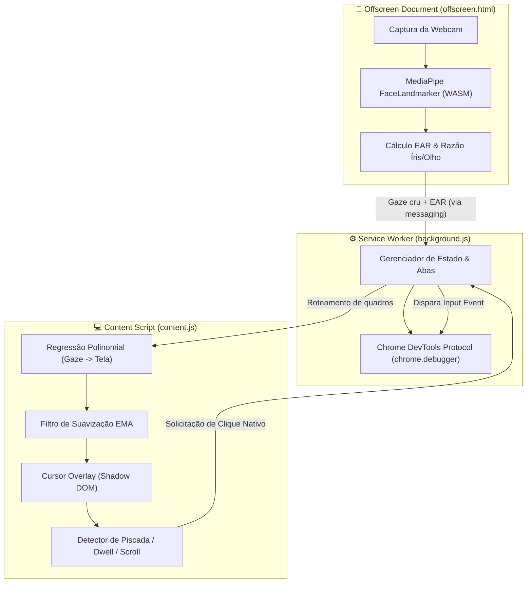

# 👁️ EyeMouse — Controle do Cursor por Rastreamento Ocular

<p align="center">
  <strong>Navegue na web 100% hands-free utilizando rastreamento ocular via webcam e Inteligência Artificial rodando localmente no navegador.</strong>
</p>

<p align="center">
  
  
  
  
  
  
</p>

---

## 🌟 Visão Geral

**EyeMouse** é uma extensão para Google Chrome (Manifest V3) projetada para proporcionar acessibilidade e navegabilidade assistiva. Ela permite controlar o cursor do mouse com o movimento dos olhos, realizar cliques por piscadas ou fixação do olhar (*dwell click*), e rolar páginas web sem a necessidade de mãos ou dispositivos físicos periféricos.

Diferente de soluções baseadas em nuvem ou bibliotecas simplificadas, o EyeMouse executa modelos avançados de visão computacional (**MediaPipe FaceLandmarker**) diretamente no hardware do usuário via **WebAssembly / GPU**, garantindo **privacidade absoluta e latência ultra-baixa**.

---

## ✨ Principais Funcionalidades

- 🎯 **Rastreamento Ocular de Alta Precisão**: Mapeamento do olhar com calibração por regressão polinomial adaptativa (9 pontos de calibração completa ou 3 pontos para recalibração rápida).
- 🖱️ **Cliques Nativos Reais (CDP)**: Disparo de eventos de clique confiáveis via Chrome DevTools Protocol (`chrome.debugger`), permitindo interação com qualquer elemento web, botões, formulários e aplicações complexas.
- 👁️ **Múltiplos Modos de Interação**:
  - **Clique por Piscada**: Piscada natural dos dois olhos (150ms a 400ms).
  - **Duplo Clique**: Duas piscadas consecutivas em menos de 350ms.
  - **Modo Fixação (*Dwell Click*)**: Clique automático ao manter o olhar parado sobre um elemento durante o tempo configurado (ideal para evitar fadiga ocular).
  - **Piscada Única (Wink)**: Olho esquerdo para rolar para baixo (*Page Down*), olho direito para rolar para cima (*Page Up*).
- 📜 **Scroll por Bordas**: Ragem automática da página ao fixar o olhar nas extremidades superior ou inferior da tela.
- 🔒 **Privacidade por Design (100% On-Device)**: O vídeo da webcam é processado exclusivamente em um contexto isolado (`chrome.offscreen`). **Nenhum frame ou dado facial é gravado, armazenado ou enviado para servidores externos.**
- ⚡ **Ativação Versátil**: Alterne entre *Ativo* e *Pausado* rapidamente via atalho (`Alt+E`), gesto de piscada rápida (Esquerdo ➔ Direito em <500ms) ou através do menu popup.

---

## 🏗️ Arquitetura do Sistema

A extensão adota uma arquitetura descentralizada para maximizar o desempenho, a segurança e o isolamento de permissões:



- **Offscreen Document (`offscreen.html`)**: Único componente com acesso à webcam. Roda a IA MediaPipe com aceleração de hardware e gera apenas coordenadas e taxas de abertura palpebral (EAR).
- **Background Service Worker (`background.js`)**: Gerencia o ciclo de vida da extensão e executa os cliques nativos via `chrome.debugger`.
- **Content Script (`content.js`)**: Injetado nas páginas web. Processa a calibração, aplica a suavização do cursor no Shadow DOM isolado da página e detecta os gestos.
- **Storage (`chrome.storage.local`)**: Fonte única de verdade para configurações e calibração.

---

## 🚀 Como Instalar e Rodar

### Pré-requisitos

- **Google Chrome** (ou navegadores Chromium v116+)
- **Node.js** v18 ou superior
- **Webcam** operacional

### Passo a Passo

1. **Clone o repositório:**
   ```bash
   git clone https://github.com/seu-usuario/eyemouse-extension.git
   cd eyemouse-extension
   ```

2. **Instale as dependências:**
   ```bash
   npm install
   ```

3. **Faça o download do modelo local do MediaPipe:**
   ```bash
   npm run download-model
   ```
   > *Nota: Este comando baixa o arquivo `face_landmarker.task` (~3.7MB) para `public/models/`.*

4. **Compile o projeto:**
   ```bash
   npm run build
   ```

5. **Carregue no Google Chrome:**
   1. Abra `chrome://extensions/` no navegador.
   2. Ative o **Modo do desenvolvedor** no canto superior direito.
   3. Clique em **Carregar sem compactação** (*Load unpacked*).
   4. Selecione a pasta `dist/` gerada na raiz do projeto.

---

## 🎯 Como Usar

1. **Calibração (Obrigatória na primeira vez):**
   - Ao instalar ou clicar em **Calibrar (9 pontos)** no popup da extensão, uma tela de calibração se abrirá.
   - Permita o acesso à câmera quando solicitado.
   - Olhe fixamente para cada um dos 9 pontos azuis e **pisque os dois olhos** para confirmar a captura. O ponto mudará para verde e avançará automaticamente.
2. **Ativação:**
   - Clique no ícone do EyeMouse na barra do Chrome e selecione **Ativar EyeMouse**.
   - Você também pode usar o atalho de teclado `Alt+E` ou piscar **Olho Esquerdo ➔ Olho Direito** em menos de 500ms.
3. **Navegação:**
   - O pontinho azul indicará para onde seu olhar está direcionado.
   - Pisque ambos os olhos por 150-400ms para clicar no elemento apontado.
   - Se preferir o modo **Fixação (Dwell)**, basta manter o olhar parado sobre um botão/link para acionar o clique sem precisar piscar.

---

## 🛠️ Scripts Disponíveis

| Comando | Descrição |
| :--- | :--- |
| `npm run dev` | Inicia o build em modo `--watch` (Vite) para desenvolvimento contínuo. |
| `npm run build` | Limpa a pasta `dist/` e gera o build final otimizado para a extensão. |
| `npm run download-model` | Baixa o arquivo do modelo IA `face_landmarker.task` para a pasta `public/models/`. |

---

## 🔒 Privacidade & Segurança

O EyeMouse foi projetado com foco estrito em privacidade:
- **Processamento 100% Local**: Nenhuma imagem da câmera é enviada para a nuvem ou compartilhada.
- **Isolamento de Origem**: A captura de vídeo é restrita à página `offscreen` da extensão. Nenhuma página web visitada possui acesso à sua câmera.
- **Sem Telemetria**: Não coletamos dados de uso, estatísticas nem hábitos de navegação.

---

## ⚠️ Limitações Conhecidas

- **Páginas Internas do Chrome**: Devido a restrições de segurança do próprio Chrome, o controle do cursor e o `chrome.debugger` não funcionam em páginas como `chrome://`, `chrome-extension://` ou na Chrome Web Store.
- **DevTools Aberto**: Se as Ferramentas do Desenvolvedor do Chrome estiverem abertas manualmente na mesma aba, o `chrome.debugger` não conseguirá anexar (o Chrome permite apenas uma sessão de debugger por aba).
- **Redimensionamento da Janela**: A calibração é associada ao tamanho atual da janela do navegador. Caso redimensione significativamente a janela ou mude de monitor, realize uma recalibração rápida (3 pontos).

---

## 🔮 Roadmap & Visão de Futuro

Estamos continuamente planejando novas formas de tornar a navegação web mais acessível. Nossas próximas versões incluem:
- 🧠 **Inferência de Intenções por IA**: Identificação automática de alvos e sugestões contextuais para usuários com movimentos oculares limitados ou condições motoras severas.
- 🧲 **Target Snap & Smart Zoom**: Atração magnética do cursor para botões/links e ampliação inteligente de alvos sob o olhar.
- 🤖 **IA Generativa On-Device**: Integração com IA local (Chrome Built-in AI) para completar tarefas e preencher formulários por olhar.

Confira a visão detalhada de desenvolvimento no arquivo [ROADMAP.md](ROADMAP.md).

---

## 📄 Licença

Este projeto está licenciado sob a licença [MIT](LICENSE) — sinta-se à vontade para utilizar, modificar e distribuir.

<p align="center">
  Desenvolvido para promover acessibilidade e tecnologia assistiva na web.
</p>

